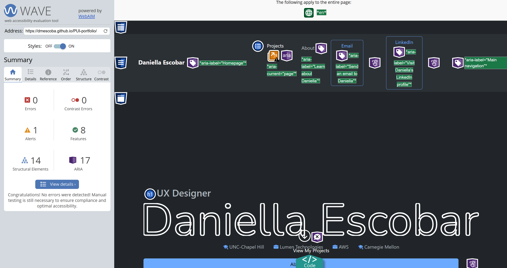
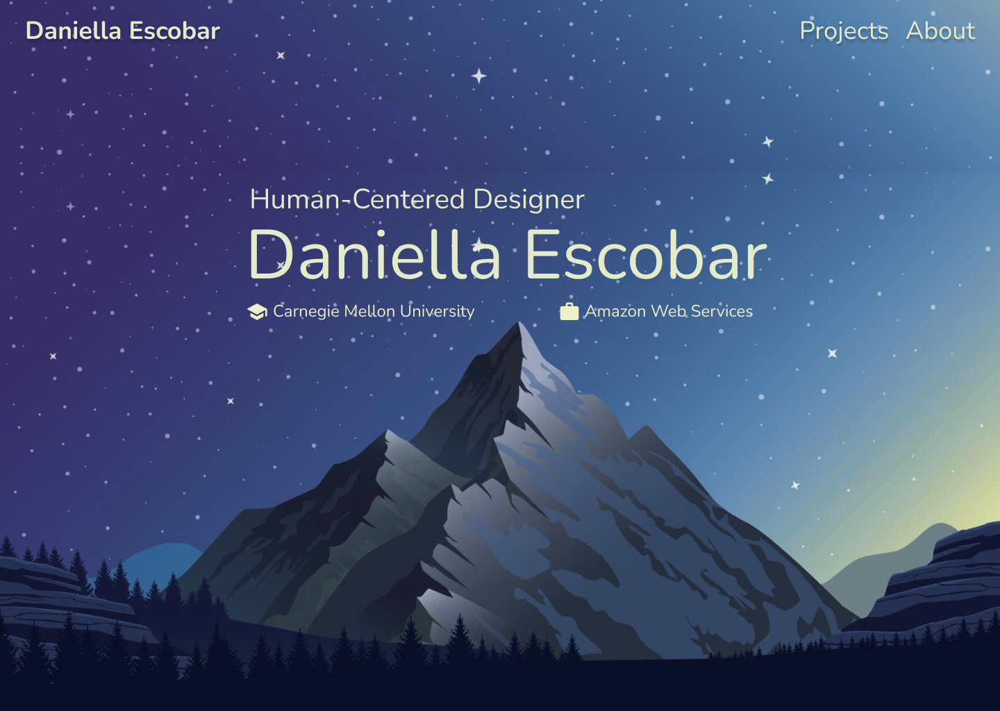
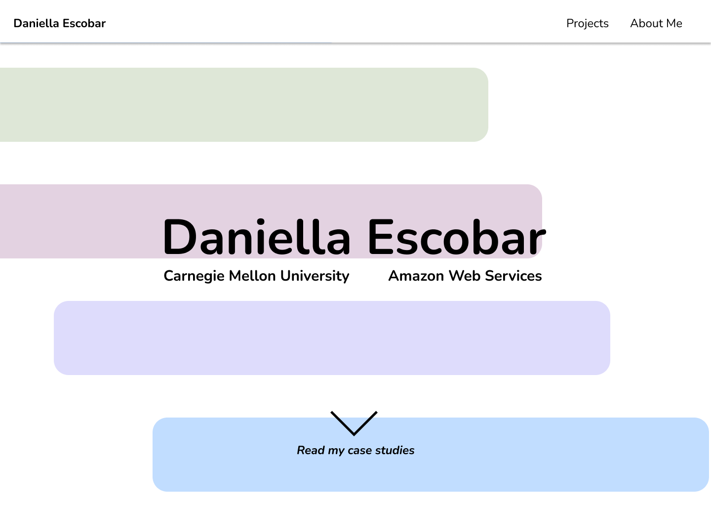
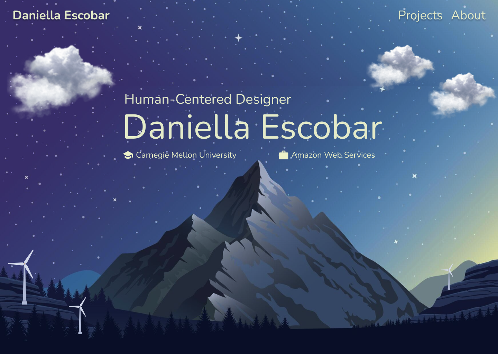
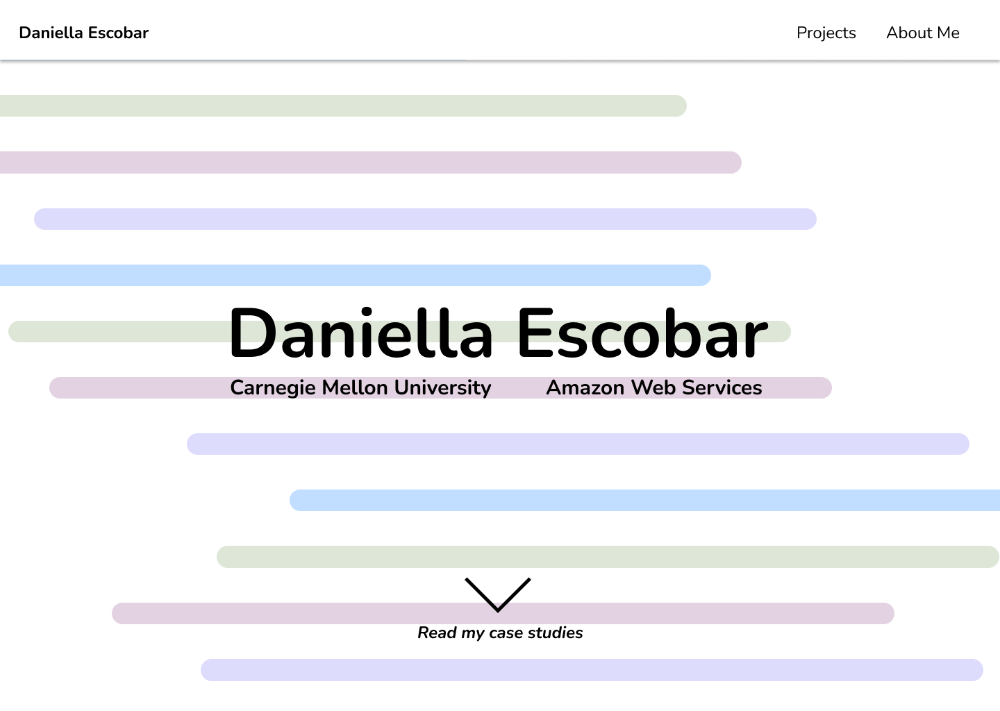
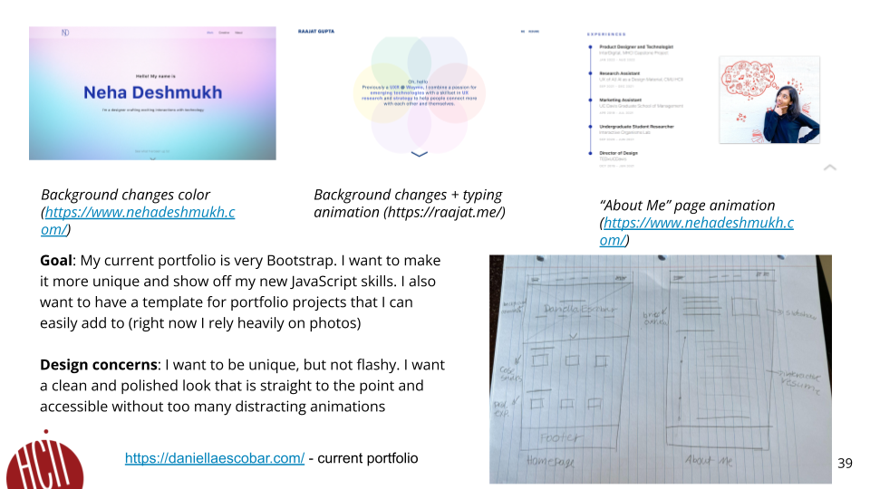
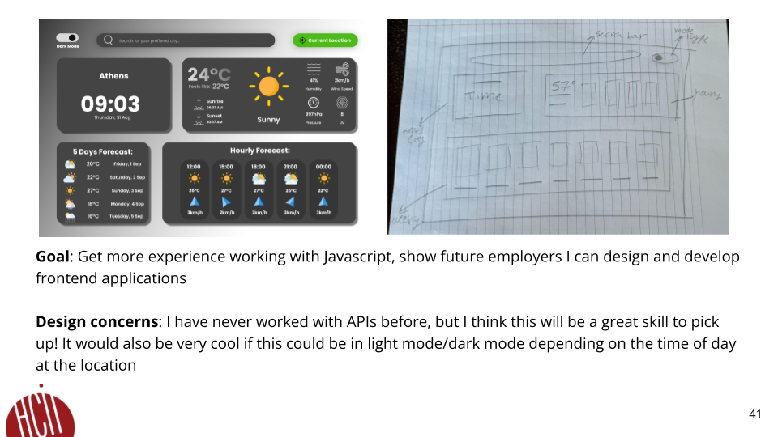
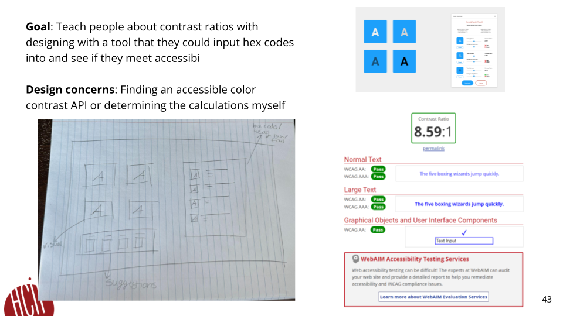

# **FP4 \- Final Project Writeup**

## Part 1: Website Description

My website is a UX Design portfolio intended to show my projects to future employers. I believe this website conveys not only my skills as a designer, but also as a front-end developer. The animations onn both the Homepage and About Me page make the website engaging because they catch the user's attention and encourage them to continue scrolling.  

## Part 2: User Interaction

Users can interact with my website through the followingg interactions: 

1. Filtering case studies. Scroll to the "Projects" section on the Homepage. Click on "Choose" in the filter. Select a filter to view the corresponding projects. 
2. Viewing Project pages. Click on the "Bubbly" project. Scroll through the page, either by using the section navigation on the left side of the screen after the Hero section on desktop or by clicking on the "Open Navigation" button on mobile. 
3. Viewing About Me page animated timeline. Click on "About Me" blue button on homepage, or "About Me" link on navigation bar. View the timeline of my resume with the option to download a PDF.  

## Part 3: External Tool

Describe what important external tool you used (JavaScript library, Web API, animations, or other). Following the bulleted list format below, reply to each of the prompts.

1. Anime.Js  
   * I chose this tool because it had interesting animations that I wanted to include on my website. I was particularly impressed with the line drawing animation for SVGs, and wanted to include that as the focal point on my homepage when the site initially loads to draw my name. 
   * I used the tool for most of the animations on my portfolio, including the Homepage Hero content appearing and the timeline animation on the About Me page. 
   * My name on the homepage uses the line drawing animation and a timeline animation to stagger when the other content appears. I also use it to make the dots for the timeline appear and bounce into the line. 
2. Bootstrap
   * I have used Bootstrap in the past and wanted to continue leveraging this tool because I think it's very user friendly and has great design. I initially wanted to learn React for this project, but was cautioned that that may have been too ambitious given my timeline.  
   * I used Bootstrap to style all of the CSS for my website. 
   * Bootstrap adds a consistency and organization to my website that is challenging to pull off with all custom code. I think it makes the content very reusable and easy to follow for future iterations. 

## Part 4: Design Iteration

My initial idea was to add parallax to my Homepage. I deviated from this idea because I worried it would make my portfolio look less professional and distract from the goal to informm future employers about my previous projects. I thought using a clean animation like the line drawing from Anime.js would better convey my style. I maintained the goal to make the homepage more engaging and less generic, as well as to include a resume timeline on my About Me page  with the option to download. Additionally, I added a project filter to make the website more complex and user-friendly. 

## Part 5: Implementation Challenge

I experienced a huge challenge with getting Anime.js to work on my deployed website instead of just locally. There was also a sizable amount of content that I wanted to include on my portfolio, and ultimately decided on creating one project page as a reusable template to be implemented on other project pages in the future. 

## Part 6: Generative AI Use and Reflection

ChatGPT was the most helpful to me in learning about accessibility standards when coding, debugging my code, and learning the documentation for both Anime.js and Bootstrap. I have always included alt text with my images, but ChatGPT taught me about aria-label and aria-labelledby, which helped me to make my code more easily navigatable. I also learned to include figurecaption for associated images as well as alt text. ChatGPT is great for answering questions about how to debug and fix code, but it doesn't have the same context as I do about my code, so it is not very helpful for writing it. Additionally, the debugging isn't always correct, and so it's only helpful in some instances. 

### Usage Experiences by Project Aspects

| Tool Name | Ratings | design | plan | write code | debug | Learn Documentation |Learn Accessibility Standards |
| :---- | :---- | :---- | :---- | :---- | :---- | :---- |
| ChatGPT | Usage | No | Yes | Yes | No | Yes | Yes | Yes |
| ChatGPT | Productivity | NA | 3 | 3 | 5 | 7 | 7 | 7 |

### Usage Reflection

> Impact on your design and plan 
* It matched my expectations and plan in [FP2](#generative-ai-use-plan) in that it would be useful for learning about best practicies. For example, 
  1. ChatGPT: It taught me about aria-label, aria-labelledby, and figure caption, as well as standards for how to make sure it is well-written.  
  2. ChatGPT: it helped me to sort through the Bootstrap and Anime.js documentation to find classes/functions that applied to my use case very efficiently. 

> Use patterns
* I accepted the generations when it concerned accessibility best practices. For example, 
  1. ChatGPT: This tool once suggested that I include aria-labels in my sections to helpl guide users and I adjusted my design according to the suggestion because I wasn't aware of how helpful it was. I thought that proper text hierarchy and alt text would be sufficient, but there was much more to be learned.  
* I critiqued/evaluated the generated suggestions by debugging code For example, 
  1. ChatGPT: This tool once suggested fixing an Anime.js animation incorrectly, and I rejected the suggestion after readind the documentation and determining what was causing the issue. 

> Pros and cons of using GenAI tools
* Pros
  1. ChatGPT: Great for learning about a new concept that you know little to nothing about and debugging complex errors in code. 
  2. Tool2:
* Cons
  1. ChatGPT: Not always correct in its suggestions and lacks context. 

### Usage Log

Document the usage logs (prompts and chat history links) for the GenAI tools you used. Some tools may not have an easy way to share usage logs, just try your best! Some instructions for different tools:

1. [ChatGPT]https://chatgpt.com/share/6754a049-e910-8000-8585-bb4f1404196b 

## Part 7: Accessibility

---

# **FP3 \- Final Project Check-in**

After exploring animation libraries and feasibility given my timeline, I have decided to utilize Anime.js to add animations to the website. I have opted for a more simplified homepage that leverages Anime.js animations for making the hero content appear, as well as animating a resume timeline on the About me Page. Additionally, I have added a filter to the projects section using JavaScript and a responsive offcanvas component to project pages to appear on scroll. Since I am no longer exploring the parallax idea, I have instead used generative AI to help me understand and sort through the documentation for Bootstrap and Anime.js. 

## Implementation Plan Updates

- [ ] Add anime.js to project
- [ ] Review Bootstrap documentation
- [ ] Explore ways of adding complexity into project, such as a project filter

## Generative AI Use Plan Updates

- [ ] Using generative AI to help me understand the anime.js documentation and use cases, such as what is possible and what is not
- [ ] Using generative AI to help me sort through the Bootstrap documentation to find the correct classes and components for my desired output

Remember to keep track of your prompts and usage for [FP4 writeup](#part-6-generative-ai-use-and-reflection).

---

# **FP2 \- Evaluation of the Final project**

## Project Description

I intend to use JavaScript to add interactivity into the homepage of my existing portfolio. In addition to this goal, I also intend on cleaning up the organization and implementation of the original code to be aligned with best practices. 

## High-Fi Prototypes

### *Prototype 1*

Users liked how the concept aligned with my professional brand, and thought the illustration would be a unique way to show off multiple of my skills.

### *Prototype 2*

Users thought the animation was very eye catching.   

## Usability Test

During usability testing of my prototypes, users provided valuable feedback on areas for improvement During usability testing of my prototypes, users provided valuable feedback on areas for improvement and challenged me to choose ideas that were more feasible and better aligned with my story. One of the prototypes I presented featured a parallax effect of a mountain landscape. Users suggested that adding more visual assets would enhance the experience, making the image more engaging. Specifically, they recommended incorporating elements like wind turbines to emphasize the theme of nature and renewable energy, along with movable clouds to create a more dynamic scrolling interaction.

I also addressed earlier feedback about my portfolio homepage. Previously, I had a generic statement about my skills as a UX Designer, which users felt was unnecessary. However, they appreciated the inclusion of my work and academic experiences. For my updated prototype, I simplified the homepage to feature only my job title, name, and highlights of my most recent work and academic experiences. This approach was intended to encourage users to scroll and interact with the parallax effect, making the experience more exploratory and engaging.

For the more abstract version of my website, users appreciated that it was more engaging compared to the previous prototype, particularly because the interactivity was accessible without any need for scrolling. However, they suggested that the animation would be more captivating if it incorporated additional lines. I updated the designs accordingly to reflect this feedback. While users found the animation visually striking and attention-grabbing, they also felt that the earlier prototype better conveyed my identity as a designer, as it directly connected to my transition into the energy industry.
 

## Updated Designs

[Prototype: Mountain Landscape Parallax](https://www.figma.com/proto/ZpOXXe3R0uDV0fITwOGaqM/PUI-Portfolio-Prototype?node-id=2-77&node-type=frame&t=0bYmgiiz04OqSiFR-1&scaling=min-zoom&content-scaling=fixed&page-id=0%3A1&starting-point-node-id=2%3A77&show-proto-sidebar=1)

For the Mountain Landscape Parallax, I added in the wind turbines to better reflect the theme and clouds to make the parallax look more realistic. 

[Prototype: Abstract Animation](https://www.figma.com/proto/ZpOXXe3R0uDV0fITwOGaqM/PUI-Portfolio-Prototype?node-id=47-974&node-type=frame&t=06YVWoJ4eeemGlfE-1&scaling=min-zoom&content-scaling=fixed&page-id=0%3A1&starting-point-node-id=30%3A86&show-proto-sidebar=1)

I made the lines thinner and added an animation of the arrow bouncing to draw the user's attention to the next portion of the website. 

## Feedback Summary

When usability testing my homepage design, I also shared my current website to gather additional feedback on other project components. Users pointed out that the headings on my individual project pages should emphasize the key takeaways from each exercise, rather than simply naming the exercise itself. For instance, instead of labeling a section on “Bubbly” as “Competitor Analysis,” they suggested using a more meaningful heading like “Existing apps charge for necessary customization,” which better captures the main insight.

Users also encouraged me to think about how my professional brand should be represented in my portfolio. I presented two concepts, but I felt much more confident about the mountain landscape idea because it ties closely to my transition into the energy industry. Beyond being more relevant to my story, users agreed that this idea was visually richer and more engaging, especially after I incorporated additional assets into the design.

I updated my designs by adding new assets to make the parallax effect more realistic and engaging. Instead of featuring only a mountain landscape, I incorporated wind turbines and clouds to enhance the scene's depth and interest. The clouds were designed to move, contributing to the parallax effect, and I’m considering animating the turbines to spin, adding a more dynamic and immediate sense of animation to this version. 

## Milestones

With FP1 and FP2 completed and the parallax option selected, my plan now focuses on three main components. First, I need to review my existing code and create a strategy for replacing any elements that are not accessible. On my project pages, several components should be coded rather than displayed as images, so I need to determine the best way to present that information effectively.

Once I have a solution for these accessibility challenges, I’ll move on to developing the parallax component of the project. This will involve creating custom assets in Illustrator and using JavaScript to integrate them into my homepage. Fine-tuning the parallax effect will require some time, so I’m estimating about a week and a half for that part of the process. After completing the parallax homepage—which is my primary goal—I plan to use the remaining time to optimize my code and align it with best practices.

### *Implementation Plan*

- [ ] Week 9 Oct 28 \- Nov 1:
  - [X] FP1 due
  
- [ ] Week 10 Nov 4 \- Nov 8:   
  - [X] FP2 due
  - [] Evaluate existing code and make note of all portions to be updated
  - [] Make implementation plan

- [ ] Week 11 Nov 11 \- Nov 15:  
  - [] Create parallax illustrations
  - [] Begin coding parallax

- [ ] Week 12 Nov 18 \- Nov 22:   
  - [] Finish coding parallax

- [ ] Week 13 Nov 25 \- Nov 29:  
  - [] Make best practices and photo changes to existing site

  - [ ] Thanksgiving  
- [ ] Week 14 Dec 2 \- Dec 6:  
  - [ ] FP4 due 

### *Libraries and Other Components*

I plan to implement the parallax effect using vanilla JavaScript, though further research may reveal that it could be more efficient to incorporate it with frameworks like React or jQuery. Additionally, I’ll be using Bootstrap as the foundational framework for this project.

## Generative AI Use Plan

I plan to leverage generative AI to learn more about implementing parallax effects, assist with debugging my code, and potentially generate imagery for the scenery on my website. I'm especially interested in using AI for image generation to inspire and enhance my design ideas.

### *Tool Use*

* ChatGPT  
  * I will use it to learn about parallax because it can help me understand how it works and what information might be helpful in approaching this from both a design and development perspective 
  * I will not use it for creating assets because it might not be able to help me with creating high quality illustrations that I am able to use on my website.  
* Illustrator
  * I will use it to draw my assets because it is an efficient tool that I am familiar with
  * The generative features in Illustrator might not be able to help me with idea generation, but for simple things like blurring backgrounds and blending colors.

### *Responsible Use*

I will use AI responsibly by crediting it when I have used it to generate design assets. I will also provide credit if a method of writing code I have used was taught to me by the AI as well. 

# **FP1 \- Proposal for Critique**

## Idea Sketches

### *Idea 1*

* The goal of this portfolio redesign is to transform my existing portfolio into a more unique and polished representation of my skills while adhering to coding best practices. 
* I intend to add interactivity through JavaScript on the website homepage and About Me page. I will have an interactive resume on the About Me page and an animated background on the homepage.   
* I will make my design accessible by removing many of the images that I have used to convey stages of my projects on the Project pages. Additionally, I will follow accessibility best practices by ensuring there is an appropriate text hierarchy, high color contrast, descriptive alt text, etc. 
* I want to convey that I’m not only a skilled UX Designer but also proficient in front-end development. The design of the portfolio itself should also showcase my strengths as a UX Designer, not just the projects I’ve included.

### *Idea 2*

* The idea is to have a weather dashboard that will show a variety of weather-related information about a given city that a user has typed in. 
* Users will be able to search for and change the city they are viewing information for. 
* My weather dashboard will follow accessibility best practices by ensuring there is an appropriate text hierarchy and high color contrast. 
* The goal of this weather dashboard is to increase my practical experience working with JavaScript, and to show that I am capable of both designing and developing front-end applications. 

### *Idea 3*

* This website will enable users to input two hex codes to check if the colors have an appropriate amount of contrast from each other. 
* There will be a visual next to the hex code checker that shows how the design changes based on user input. 
* Aside from following accessibility best practices, this website itself is an accessibility tool in helping users determine if their colors have an appropriate amount of contrast to pass various WCAG standards. 
* The goal of this color contrast checker is to increase my practical experience working with JavaScript and to gain familiarity with color contrast ratios. 

## Feedback Summary

For my revamped portfolio, my classmates cautioned me against including too much JavaScript interactivity to the point where it detracts from the main objective of my portfolio, which is to highlight my case study projects. However, they were enthusiastic about using interactivity to strategically engage users on the homepage and resume page. They saw this idea as a strong opportunity to enhance my portfolio, especially since it’s already coded, and suggested it would be a great wrap-up to the course to showcase everything I’ve learned about best practices, code organization, and accessibility. As a UX Designer, they also thought this would be the most beneficial to my career development. They were less excited about my weather dashboard project, but understood my reasoning. I wanted to gain foundational experience working with APIs, focusing less on the design and more on the dashboard’s functionality. My classmates felt I could showcase my creativity in better ways. They did however acknowledge that a JavaScript-heavy project would increase my empathy as a designer when collaborating with developers. One classmate also pointed out that, given the time constraints, this project might be the most feasible. The color contrast checker was a popular idea, especially if I incorporated gamification. Instead of simply letting users input hex codes, what if they were given two colors and asked to guess the contrast ratio? They did warn me about the challenges of finding a color contrast API and suggested I might need to calculate the ratios manually. They also encouraged me to think about how this design would translate to mobile devices and whether it would be as impactful of an experience. If the point is for the user to see how changing the hex codes affects the contrast of the letter on top of the box, a mobile experience may not be very effective in demonstrating the concept. 

## Feedback Digestion

I believe the feedback on my revamped portfolio was thoughtful and helpful. One suggestion I plan to explore further is how I want the landing page to function. Should I prioritize introducing myself with a full-screen introduction that encourages hiring managers to scroll down to see my projects, or should I opt for a brief introduction with more emphasis on showcasing my case studies right from the start? I'll need to reflect on this distinction and brainstorm how each approach could shape the overall look and feel of my portfolio with additional sketches. While the weather dashboard offers valuable experience with APIs, I do agree that it doesn’t fully reflect my creative abilities as a designer. My goal is to showcase myself as a UX designer with front-end development skills, and having a project that replicates a simple concept might detract from the other more creative pieces in my portfolio. Although working on this project would likely improve my empathy for developers, I believe the same could be said for the other ideas as well. I do have some concerns about time constraints with the other projects in terms of how much I can realistically accomplish, but I am not sure this would be as worthwhile in the end. As for the color contrast checker, the gamification idea is interesting, but it diverges from my original intent of creating a practical tool for designers to adjust hex codes. Gamifying the experience would make it more educational about contrast ratios rather than a functional design tool. If I pursue this project, I’ll need to reconsider my approach and adjust my expectations to better incorporate the gamification element since it was so popular. 

